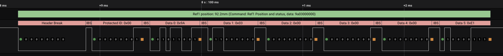

# LINAK desk protocol analyzer (for use with Saleae Logic analyzer)

  
## Getting started

1. Make and install the modified LIN analyzer contained in `./lowlevel_analyzer`
  - The modifiction is basically that LINAK LIN does not use a sync byte
2. Point your Saleae tool at the high-level analyzer in this repo
3. Splice into the control signal of your desk, which is at pins 1 and 6 of the RJ45 connector
  - If you're using cat5/6 cable made according to TIA/EIA 568B:
    - Pin 1 is GND, on the orange/white conductor
    - Pin 6 is LIN, on the green conductor
4. Add the modified low-level analyzer on the captured LIN signal (note that it is 0-12V, so you need to configure your input accordingly or add a level shifter)
5. Add this high-level analyzer on the low-level-analyzed signal
